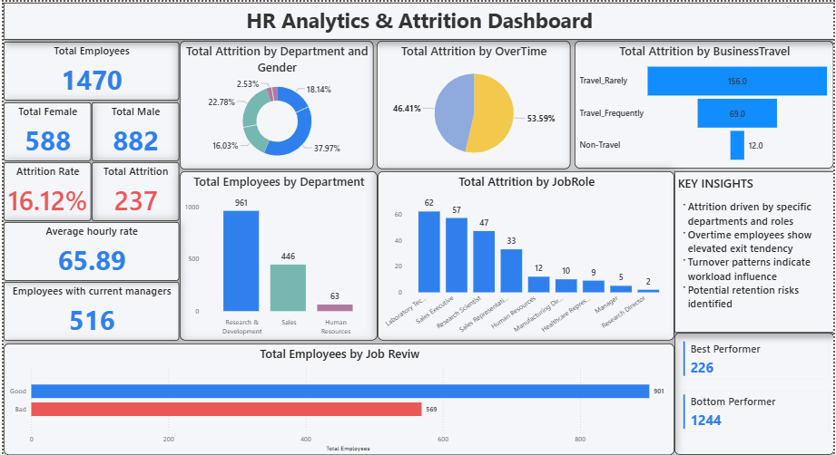

<h1 align="center"> Hi 👋,I'm Kandi Durga Verma</h1>

  <b>Associate Power BI Developer | Data Analytics & Dashboard Projects</b> 
  Career Transition: 3D Animation → Data Analytics & Business Intelligence

---

## 👋 About Me

Detail-oriented professional transitioning into **Data Analytics & Business Intelligence** with hands-on experience in building interactive dashboards and analytical reports.

With a background in **3D Animation**, I bring strong **visual storytelling, design thinking, and attention to detail** into data visualization and reporting.

I enjoy transforming raw data into **clear, actionable insights**.

---

## 🚀 Core Competencies

- 📊 Power BI Dashboard Development  
- 🧮 DAX & Time Intelligence  
- 🏗 Data Modeling (Star / Snowflake Schema)  
- 🔄 Power Query (ETL & Transformation)  
- 🗄 SQL / SQL Server / MySQL  
- 📈 KPI Design & Analytical Reporting  
- 🔐 Row-Level Security (RLS)  
- 📑 Excel for Data Analysis  

---

## 🛠 Tools & Technologies

  
  
  
  
  

---

## 📌 Featured Projects

---

### 📊 HR Analytics / Workforce Insights

Workforce analytics dashboard focused on:

✔ Employee Attrition & Trends  
✔ Department-wise Headcount  
✔ Hiring & Workforce Patterns  
✔ Performance Indicators  

---

### 📉 Customer Churn Analysis

Customer behavior & retention analytics:

✔ Churn Risk Indicators  
✔ Behavioral Trends  
✔ Retention Insights  

---

### 💳 Credit Risk Analysis

Financial performance & risk dashboard:

✔ Loan Performance Metrics  
✔ Risk Indicators  
✔ KPI-driven Insights  

---

### 📞 Call Centre Analytics

Operational efficiency dashboard:

✔ Call Volume Monitoring  
✔ Agent Performance  
✔ Service Metrics  

---

### 🚚 Supply Chain Reporting

Interactive operational reporting:

✔ Performance Metrics  
✔ Drill-down Analysis  
✔ Dynamic Filters  

---

## 📚 Currently Strengthening

- Advanced DAX Patterns & Optimization  
- Data Modeling Best Practices  
- Dashboard Performance Tuning  
- Business-driven Analytics Scenarios  

---

## 📬 Contact

📍 Hyderabad, India  
📧 **durga.it.94@gmail.com**  
🔗 LinkedIn: *https://www.linkedin.com/in/k-durga-verma-000021124/*

---

⭐ Open to <b>Associate / Junior Power BI Developer</b> & <b>Data Analyst</b> Opportunities

